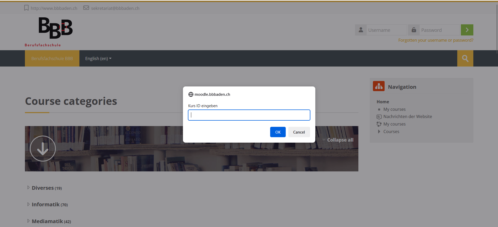

# quick-ID
Dieses Skript öffnet einen Dialog, in dem Sie eine Kurs-ID eingeben können, um direkt dorthin weitergeleitet zu werden.

Das Menu wird mit der Tastenkombination ```ALT + E``` geöffnet.

## Installation

Sie können das Userskript [hier von GitHub](https://github.com/BBBaden-Moodle-userscripts/quick-ID/raw/main/quick-ID.user.js) installieren.

## Vorschau



## Konfiguration

Falls erforderlich, können Sie im Userskript-Addon eine Konfiguration vornehmen, um bestimmte Funktionen zu aktivieren oder zu deaktivieren. Fügen Sie dazu einen Wert mit dem Namen "makeRequests" hinzu.

#### makeRequests
Bestimmt, ob das Skript einen HTTPS-Request an die Kurs-Website senden soll, um zu überprüfen, ob dieser Kurs überhaupt existiert.

### Beispiel-Konfiguration:

```json
{
  "makeRequests": true
}
```

[mehr Info](https://github.com/black-backdoor/userscript-installation-guide/blob/main/additional-guide/violentmonkey-add-script-value.md)

### Values

- **makeRequests** (boolean)
